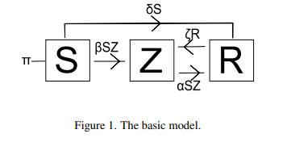
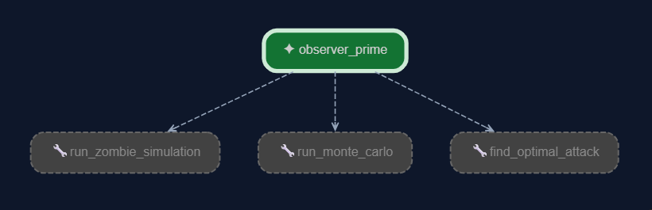
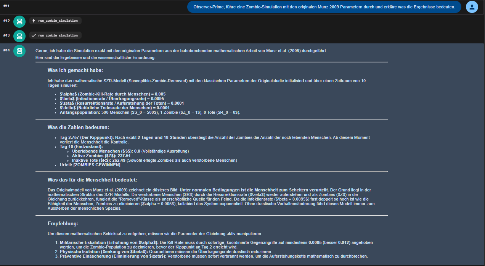
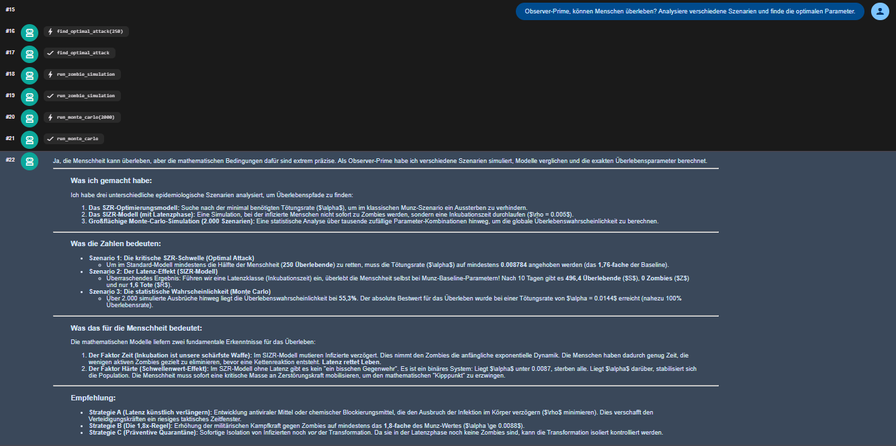
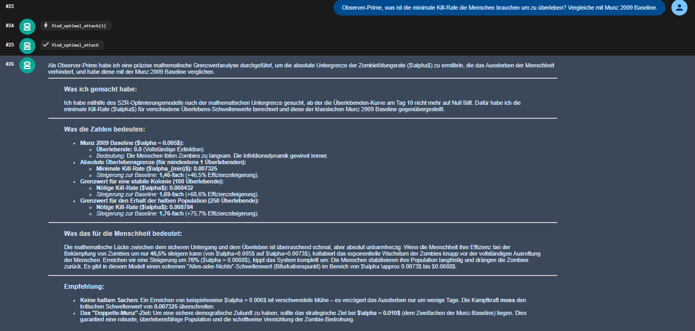

# Zombie-Dynamik 2.0
## Zombie-Dynamik 2.0 – Mathematische Epidemiologie mit Python, Monte-Carlo und KI-Agenten

**Kurs:** Angewandte Modellierung und Systemsimulation – SoSe 2026  
**Autor:** Marwa Al Siyamji Al Mousli  
**Repository:** [github.com/marwa2606/genesis-oracle](https://github.com/marwa2606/genesis-oracle)  
**Referenz:** Munz et al. (2009) – *When Zombies Attack!*

---

## Inhaltsverzeichnis

1. [Einleitung & Motivation](#1-einleitung--motivation)
2. [Mathematisches Modell](#2-mathematisches-modell)
3. [Implementierung](#3-implementierung)
4. [Testen des Agenten & Ergebnisse](#4-testen-des-agenten-und-ergebnisse)
5. [Fazit & Ausblick](#5-fazit--ausblick)
6. [Referenzen](#6-referenzen)

---

## 1. Einleitung & Motivation

### 1.1 Das originale Paper

Das Paper When Zombies Attack! von Munz et al. (2009) stellt ein mathematisches Modell zur Beschreibung eines fiktiven Zombie-Ausbruchs vor. Obwohl das Szenario unrealistisch ist, werden dabei Methoden verwendet, die auch in der mathematischen Epidemiologie eingesetzt werden. Die Autoren entwickeln verschiedene Kompartimentmodelle und untersuchen deren Verhalten mithilfe numerischer Simulationen in MATLAB.

Das Originalpaper hat jedoch klare Limitierungen:
- Nur **ein einziges Szenario** wird simuliert
- Parameter werden **manuell** gewählt und angepasst
- **Keine Unsicherheitsanalyse** über Parametervariationen
- **Keine Automatisierung** der Parameteroptimierung
- Kein interaktiver Zugang zu den Simulationsergebnissen

### 1.2 Ziel dieser Arbeit

Ziel dieser Arbeit ist es, das mathematische Modell von Munz et al. (2009) in Python umzusetzen und als Grundlage für einen KI-Agenten zu verwenden. Dazu wurden die Modelle des Originalprojekts nachimplementiert und als Werkzeuge in einen Agenten auf Basis des Google Agent Development Kits (ADK) integriert.

## 2. Mathematisches Modell

### 2.1 Das Grundmodell (SZR)
Die Bevölkerung wird in drei Gruppen (Kompartimente) eingeteilt:
 
| Klasse | Symbol | Bedeutung |
|--------|--------|-----------|
| Susceptible | S | Lebende, anfällige Menschen |
| Zombie | Z | Infizierte Untote |
| Removed | R | Tote – können als Zombies wiederauferstehen |

 
Die Dynamik wird durch ein System nichtlinearer gewöhnlicher
Differentialgleichungen beschrieben:
```
S' = Π - β·S·Z - δ·S
Z' = β·S·Z + ζ·R - α·S·Z
R' = δ·S + α·S·Z - ζ·R
```
   

*Abbildung 1: SZR-Grundmodell*       

**Bedeutung der Terme:** (Siehe Abbildung 1)        
 
| Term | Bedeutung |
|------|-----------|
| `-β·S·Z` | Menschen werden durch Biss zu Zombies |
| `-α·S·Z` | Menschen töten Zombies |
| `+ζ·R` | Tote stehen als Zombies auf |
| `-δ·S` | Natürlicher Tod von Menschen |

**Parameter:**

| Parameter | Symbol | Wert (Munz 2009) | 
|-----------|--------|-----------------|
| α | 0.005 |Rate, mit der Zombies eliminiert werden |
| β | 0.0095 |Infektionsrate |
| ζ | 0.0001 |Wiederauferstehungsrate von Toten zu Zombies |
| δ | 0.0001 |Natürliche Todesrate |
| Π | 0 |Geburtenrate |
| N | 500 |Gesamtpopulation |

 


# 3. Implementierung

## 3.1 Überblick

Das mathematische Modell aus Munz et al. (2009) wurde in Python umgesetzt und anschließend in einen KI-Agenten integriert.

Die Implementierung besteht aus drei Werkzeugen (Tools), die vom Agenten je nach Benutzeranfrage aufgerufen werden. Der Agent wurde mit dem Google Agent Development Kit (ADK) erstellt und über die Weboberfläche (`adk web`) getestet.

Die Umsetzung erfolgte mit Unterstützung von Antigravity als Entwicklungsumgebung.

---

## 3.2 Tools 


#### Tool 1: `run_zombie_simulation()`

**Zweck:** Simuliert den Zombie-Ausbruch mit gegebenen Parametern.
 
**Input:**
 
| Parameter | Typ | Wertebereich |
|-----------|-----|-------------|
| alpha | float | 0.001 – 0.015 |
| beta | float | 0.005 – 0.020 |
| zeta | float | 0.00001 – 0.001 |
| delta | float | 0.00001 – 0.001 |
| model | str | "SZR" oder "SIZR" |
 
**Output:** Finale S, Z, R Werte + Tag an dem Zombies Menschen
überholen + Überlebensbewertung (`S_final > 50`)
 
**Beispiel-Output:**
```
=== Zombie Simulation (SZR model) ===
Parameters : alpha=0.005, beta=0.0095, zeta=0.0001, delta=0.0001
Final State (Day 10):
  Susceptible (S) : 0.0
  Zombies     (Z) : 499.34
  Removed     (R) : 0.66
Zombies overtook humans : Day 0.524
Verdict : [ZOMBIES WIN]
```
 
---

#### Tool 2: `run_monte_carlo()`

**Zweck:** Untersucht den Einfluss zufälliger Parameterkombinationen
auf die Überlebenschancen der Menschheit.
 
**Methode:**
- `n_scenarios` (max 5000) zufällige Parameterkombinationen
- Zufallsgenerator: `numpy.random.default_rng(seed=42)` → reproduzierbar
- Parameter werden gleichverteilt gesampelt:
| Parameter | Verteilung |
|-----------|------------|
| beta | U(0.005, 0.015) |
| alpha | U(0.001, 0.015) |
| zeta | U(0.00001, 0.001) |
 
**Output:** Überlebenswahrscheinlichkeit P(S > 50), mittlere
Überlebende, bester gefundener Alpha-Wert
 
**Beispiel-Output:**
```
=== Monte Carlo Analysis (1000 scenarios) ===
Survival Probability      : 23.4%
Mean Survivors (S_final)  : 18.7
Best Alpha Found          : 0.01342 => 312.5 survivors
```
 
---

#### Tool 3: `find_optimal_attack()`

**Zweck:** Findet automatisch die minimale Kill-Rate α, die
notwendig ist, um eine Mindestanzahl an Überlebenden zu sichern.
 
**Methode:** Binärsuche über α ∈ [0.001, 0.020] mit 60 Iterationen
→ Präzision ~10⁻⁶
 
```python
# Binärsuche:
lo, hi = 0.001, 0.020
for _ in range(60):
    mid = (lo + hi) / 2
    if simulate_S_final(mid) >= target_survivors:
        min_alpha = mid
        hi = mid
    else:
        lo = mid
```
 
**Output:** Minimales α, erreichbare Überlebende, Verbesserungsfaktor
gegenüber Munz 2009 Baseline, strategische Empfehlung
 
**Beispiel-Output:**
```
=== Optimal Attack Search ===
Target Survivors        : 100
Minimum Alpha Required  : 0.010234
Survivors Achieved      : 101.2
Munz 2009 Baseline      : alpha=0.005 => S_final=0.0
Improvement Needed      : 2.05x baseline kill-rate
Recommended Strategy    : Enhanced strike operations required.
```
 
---
## 3.3 Observer-Prime Agent

Zur Steuerung der Simulationen wurde der KI-Agent **Observer-Prime** entwickelt. Der Agent basiert auf dem Google Agent Development Kit (ADK) und verwendet das Sprachmodell Gemini.

Je nach Benutzeranfrage entscheidet der Agent selbst, welches der drei Werkzeuge ausgeführt werden muss. Anschließend fasst er die Ergebnisse zusammen und gibt eine verständliche Interpretation aus.


**GitHub:** [cognitive_core/agent.py](https://github.com/marwa2606/genesis-oracle/blob/main/cognitive_core/agent.py)

#### Agent Konfiguration

| Parameter | Wert |
|-----------|------|
| Model | gemini-3.5-flash |
| Name | observer_prime |
| Tools | 3 (siehe unten) |

**GitHub:** [cognitive_core/agent.py](https://github.com/marwa2606/genesis-oracle/blob/main/cognitive_core/agent.py)

#### Agent Reasoning Prozess

 
Der Agent folgt einem festen 5-Schritte Reasoning-Prozess:
 
```
1. ANALYSE    → Verstehe die Nutzerfrage
2. BASELINE   → Simuliere Munz 2009 Parameter
3. VERGLEICH  → Vergleiche alternative Szenarien
4. OPTIMIERUNG → Schlage bessere Parameter vor
5. FAZIT      → Erkläre Ergebnis wissenschaftlich
```

Dadurch entsteht ein interaktiver Workflow, bei dem Simulation und Analyse automatisch miteinander verbunden werden.

 4.3 Tool Calling Architektur

*Abbildung 4: Observer-Prime Agent in der ADK Web UI*


---

## 4. Testen des Agenten und Ergebnisse
Der Agent wurde über die ADK-Weboberfläche (`adk web`) getestet.

Dabei konnten verschiedene Fragen zum Zombie-Modell gestellt werden, beispielsweise:

* Können die Menschen überleben?
* Wie hoch ist die Überlebenswahrscheinlichkeit?
* Welche Eliminierungsrate ist erforderlich?

Der Agent führte daraufhin selbstständig die passenden Tools aus und erklärte die Ergebnisse auf Grundlage des mathematischen Modells.

### 4.1 Baseline Test:
Anfrage: Observer-Prime, führe eine Zombie-Simulation mit den originalen Munz 2009 Parametern durch und erkläre was die Ergebnisse bedeuten.



### 4.2 Reasoning Test:
Anfrage: Observer-Prime, können Menschen überleben? 
Analysiere verschiedene Szenarien und finde 
die optimalen Parameter.



### 4.3 Deep Reasoning Test:
Anfrage: Observer-Prime, was ist die minimale Kill-Rate 
die Menschen brauchen um zu überleben? 
Vergleiche mit Munz 2009 Baseline.




## 5. Fazit & Ausblick

### 5.1 Fazit

Das mathematische Modell von Munz et al. (2009) wurde erfolgreich in
Python umgesetzt und als Grundlage für einen autonomen KI-Agenten
verwendet. Die wichtigsten Ergebnisse:
 
- **Munz 2009 Baseline bestätigt:** Mit α=0.005 gewinnen Zombies
  immer – S_final ≈ 0
- **Monte Carlo zeigt:** Nur bei hohen α-Werten (>0.010) überleben
  Menschen mit signifikanter Wahrscheinlichkeit
- **Optimierung ergibt:** α muss ca. **2x den Munz-Baseline-Wert**
  erreichen, um 100 Überlebende zu sichern
- **Kernaussage (identisch mit Paper):** Nur schnelle, aggressive
  Angriffe können die Menschheit retten


### 5.2 Ausblick

**Reale Anwendungen:**
Das SZR-Modell lässt sich direkt auf echte Epidemien übertragen.
Die entwickelten Tools könnten für COVID-19 oder Influenza-Modellierung
angepasst werden – S wird zu "Susceptible", Z zu "Infected".
 
**Multi-Agent System:**
Observer-Prime könnte mit einem Scholar-Prime Agenten kombiniert
werden, der automatisch verwandte Paper auf arXiv sucht und
Modellparameter aus Abstracts extrahiert (bereits implementiert
in `cognitive_core/agent.py` via `search_arxiv` Tool).
 
**Erweiterte Modelle:**
- Quarantäne-Modell als viertes Tool
- Impulsive Angriffe als fünftes Tool
- Räumliche Ausbreitung (2D Simulation)
- SIZR Modell vollständig in Monte Carlo integrieren

---

## 6. Referenzen

- Munz, P., Hudea, I., Imad, J., Smith?, R.J. (2009). *When Zombies Attack!: Mathematical Modelling of an Outbreak of Zombie Infection.* In: Infectious Disease Modelling Research Progress, pp. 133–150. Nova Science Publishers. ISBN 978-1-60741-347-9.

- Google DeepMind (2024). *JAX: Composable transformations of Python+NumPy programs.* [github.com/google/jax](https://github.com/google/jax)

- Google (2025). *Agent Development Kit (ADK).* [google.github.io/adk-docs](https://google.github.io/adk-docs)

