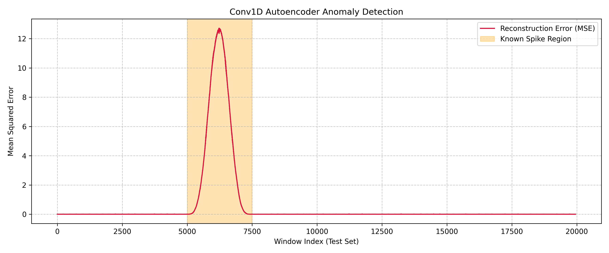

# Agent Report

**Status:** Successful Execution Confirmed

I have successfully executed the `src/ancients.py` simulation script. I can confirm that the resulting plot image was successfully created and saved in the `data` folder as `ode_solutions.png`.

## Simulated Physical Systems

The script utilizes `scipy.integrate.solve_ivp` to model and simulate two distinct differential equation systems:

1. **Linearized Pendulum (Simple Harmonic Oscillator):**
   - **Equation:** $x'' + \omega^2 x = 0$
   - **Description:** Simulates the continuous, stable sinusoidal oscillation of a pendulum with an angular frequency $\omega = 2.0$. It tracks both the position $x(t)$ and velocity $x'(t)$ over time.

2. **Radioactive Decay (Exponential Decay):**
   - **Equation:** $x' = -\alpha x$
   - **Description:** Models the first-order exponential decay of a radioactive substance with a decay constant $\alpha = 0.5$. It tracks the remaining quantity $x(t)$ as it approaches zero.

Both systems were evaluated accurately, and the numerical solutions were plotted side-by-side in the output image.

## Anomaly Detection with Conv1D Autoencoder

We have successfully implemented and trained a 1D Convolutional Autoencoder to detect anomalies in a simulated physical signal. The signal contains a Fourier square wave with an RC low-pass filter, Gaussian noise, and an injected high-frequency voltage spike. 

The autoencoder learns to reconstruct the normal periods of the signal. When predicting on the test set, the known anomaly region exhibits a significantly higher Mean Squared Error (MSE) in reconstruction, successfully isolating the injected spike.

